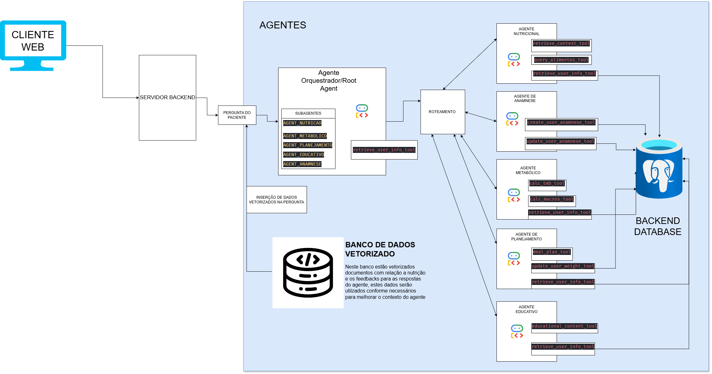

# 🍎 NutriXpert - Manual do Usuário

Bem-vindo ao **NutriXpert**, seu ecossistema inteligente de orientação nutricional. Este sistema utiliza Inteligência Artificial avançada para personalizar recomendações, esclarecer dúvidas e auxiliar no seu planejamento alimentar, tudo baseado em dados científicos e no seu perfil pessoal.

## 🧠 Como o Sistema Funciona

O NutriXpert não é apenas um "chatbot" comum. Ele funciona como uma clínica virtual composta por vários **Agentes Especialistas**.

Quando você envia uma pergunta, nosso **Orquestrador Inteligente** analisa seu pedido e o encaminha para o especialista mais adequado (Nutrição, Metabolismo, Planejamento, etc.). Você não precisa escolher com quem falar; o sistema faz isso automaticamente.

---

## 🚀 Primeiros Passos: A Anamnese

Ao iniciar sua jornada no NutriXpert, o primeiro passo é obrigatório: **A Anamnese**.

- **O que é:** Uma entrevista amigável para o sistema conhecer você.
- **O que será perguntado:** Objetivo (emagrecer, ganhar massa, saúde), nível de atividade física, restrições alimentares, sono, hidratação, etc.
- **Por que é importante:** Sem isso, os outros agentes não conseguem personalizar dietas ou cálculos para o seu corpo.

> **Dica:** Seja sincero nas respostas. Quanto mais precisos forem seus dados, melhor será o seu plano alimentar.

---

## 🛠️ Funcionalidades e Especialistas

Aqui está o que cada agente pode fazer por você:

### 1. 🥗 Agente de Planejamento (Seu "Nutricionista Pessoal")

Responsável por criar rotinas alimentares personalizadas baseadas no seu perfil.

- **O que pedir:**
  - "Crie um cardápio semanal para emagrecimento"
  - "O que posso comer no café da manhã?"
  - "Atualize meu peso para 75kg" (Atualização de dados)
- **Diferencial:** Ele adapta as calorias, a frequência das refeições e as escolhas alimentares baseando-se na sua anamnese (gostos, rotina, saúde e objetivos).

### 2. 🔬 Agente Nutricional (A "Enciclopédia")

Especialista na composição química e dados técnicos dos alimentos.

- **O que pedir:**
  - "Quantas calorias tem no feijão?"
  - "Qual tem mais proteína: frango ou peixe?"
  - "Me dê uma substituição saudável para o pão francês"
- **Base de Dados:** Utiliza tabelas oficiais (como a TACO) para fornecer dados precisos sobre macronutrientes (carboidratos, proteínas, gorduras) e micronutrientes.

### 3. ⚡ Agente Metabólico (O "Calculador")

Focado em números, cálculos matemáticos e na fisiologia do seu corpo.

- **O que pedir:**
  - "Calcule minha Taxa Metabólica Basal (TMB)"
  - "Qual meu IMC?"
  - "Quantas calorias gasto por dia (TDEE)?"
- **Como interpretar:** Ele explica as fórmulas utilizadas e o que os resultados significam para a sua saúde metabólica.

### 4. 📚 Agente Educativo (O "Professor")

Ensina conceitos teóricos de nutrição de forma didática e acessível.

- **O que pedir:**
  - "O que é índice glicêmico?"
  - "Por que preciso de vitamina C?"
  - "Como funciona a digestão?"
- **Estilo:** Respostas estruturadas com definições, explicações simplificadas, exemplos práticos e curiosidades.

---

## 💡 Dicas de Uso

- **Personalização Automática:** As respostas levam em conta seus dados. Se você disse que é diabético na anamnese, o Agente de Planejamento evitará sugerir açúcar simples.
- **Atualização de Rotina:** Se sua vida mudou (ex: começou a fazer academia ou mudou de objetivo), avise o sistema: _"Comecei a fazer musculação 3x na semana"_ ou _"Quero mudar meu objetivo para ganho de massa"_. O Agente de Anamnese atualizará seu perfil.
- **Interpretação:** O sistema é programado para ser acolhedor, motivacional e sempre explicar o "porquê" das recomendações.

## ⚠️ Aviso Legal (Disclaimer)

O **NutriXpert** é uma ferramenta educativa e de suporte ao bem-estar.

1.  **Não substitui profissionais:** As orientações deste sistema não substituem o acompanhamento presencial de médicos ou nutricionistas.
2.  **Não é um médico:** O sistema não faz diagnósticos clínicos, não prescreve medicamentos e não trata doenças graves.
3.  **Estimativas:** Cálculos de calorias e gastos energéticos são estimativas baseadas em fórmulas científicas padrão, podendo variar conforme a individualidade biológica.
